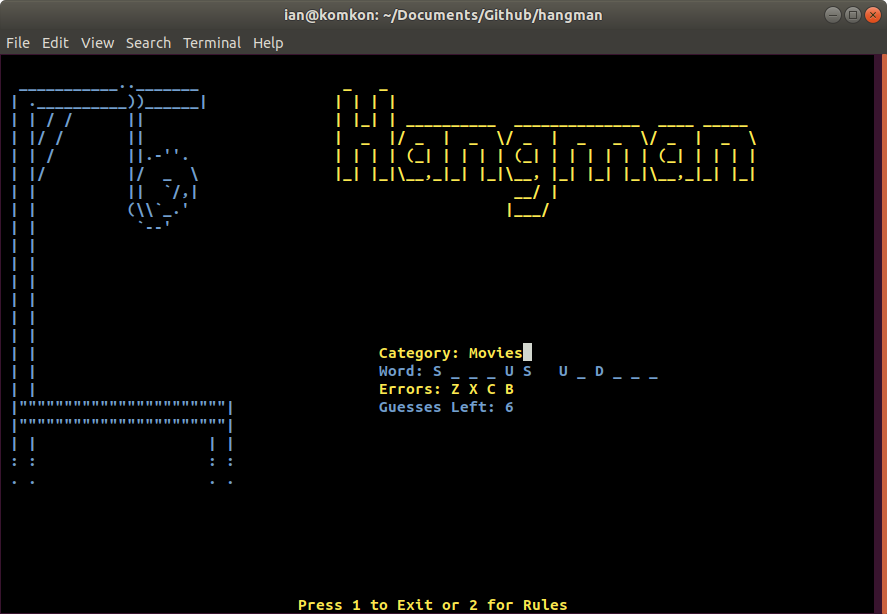

# Hangman
School Project Grade 8. Fun project to do in your spare time.

School Write-Up (please ignore, scroll lower for important instructions)

I started off the program by importing the time, curses, and random libraries. I use all of them to make my program more interesting. Theses libraries are used to add pauses, beautiful text, and random word picking in the program. I continued the program by creating the read_drawing function. It is used to read the file that the drawing is in and then it removes the trailing end backspaces and enters. It adds the line to the end of the drawing list and then it returns that list. I then proceeded to make a function that draws my title. It displays the file in a certain location. After receiving the coordinates, the program draws each line, column by column. After that, I made the stage drawing function. It is set to display the stages in the top left corner of the screen. It receives the coordinates (in this case, (1,1)) and then it prints the corresponding stage line by line. I then have the function that does most of the work. It starts off by reading all of the files (stages, rules, etc.) It uses the read_drawing function and the specified path to do this. Then, it wipes the screen and the curses library is initialized. Both of the colour pairs are defined and the title is displayed. After that, a random word is picked from the word bank. It is the secret word that the user has to guess. Then, all the parts of the game are displayed (rules, status bar, etc.) Then, the main part of the game is executed. While there are still letters that remain to be guessed, the program gets the code of the key that was pressed and then converts in to an ASCII character (characters that are used in languages). When it receives the letter, the program determines whether it is is right, wrong, or already guessed. It does this with the use of the letter_work function. Then, if there are 10 errors at this point, the “Game Over” message is displayed, the program waits for 2 seconds, and then it exits. After that, if the character pressed was 1, then the program exits. If the character pressed was 2, then the program displays the rules with the use of the draw_message function and the scr and game_over parameters. Then, the program waits for 5 seconds and wipes the screen. The program proceeds to redraw/ redisplay all of the updated visual components of the game. However, if all of the letters were guessed, the program does not complete/run through the above cycle. Instead, the screen is cleared, a “Game Over” message is displayed, and the program quits after 2 seconds. The next function, word_work, replaces the letters in the secret word with underscores and leaves the special characters as is. It does this with the use of the is.alpha() function. If the character in the secret word is a letter (alphabetical), the letter is replaced with an underscore and is added to the end of the guess list. If the character is not alphabetical, it is left as is and is added to the end of the guess list. The following function, letter_work, determines whether a letter is right, wrong, already right, or already wrong. If the letter is already guessed, nothing happens. If the letter is wrong, it is added to the end of the errors list. If the letter is right, the required underscores are replaced with the letter. Every letter in the secret word is checked to see if it matches with the guessed letter. If the letter matches, the underscore in that index is replaced with the guessed letter. Finally, this function returns the result. This is very useful for checking if the letters are being determined correctly (with the use of pytest.) The next function is used to display the secret word (using underscores and secret characters) on the screen. It also displays the “Word:” text. It gets the the required coordinates and prints the correctly guessed letters as required. The following function, draw_errors, displays all of the errors and the “Errors:” text before them in the designated positions. The start_row and start_col variable give coordinates for where to print the errors, and the text “Word:” is displayed 6 columns before the errors. The next function, draw_message, is only used when the game ends. It is used to display the “Game Over” text and the box around it. The coordinates for both the box and the message are given and on command, they are both displayed. The following two functions display the category and status bar (equivalent of the menu) in their designated positions. They both use the same code as the previous functions, except for the positioning code in draw_status_bar. The program gets the max values for x and y (length and width) and then the text is printed on the last line in the middle of the screen (with the use of a simple equation.) The next function, draw_guess_left, is used to display the amount of guesses left and the text preceding that number. To get the amount of guesses left, we subtract the total amount of guesses (10) and the length of errors (the amount of errors made). Then, if the amount of errors made is more than one, it adds a space to the end of the number to remove the 0 that is left over from the 10. Next, there is the draw_rules function. It is used to display the rules and the box around it. It uses the same code as the draw_rules function. Last but not least, there is the main function of the program. It gives control to the curses library which allows for all of the beautiful text to be displayed. Finally, the last two lines of the code say that if the script is run as a main program (AKA not from the pytest program), then, execute the main function.


IMPORTANT THINGS:


Here are 3 important tips for running the program:
1. The program cannot be run from IDLE. It can be run from command prompt (Windows) or Terminal (Linux-based operating systems).
2. Linux-based systems have the curses library pre-installed; the instructions below do not apply.
3. If the program window is too small at any point, the program will return an error. Please make the screen larger and try again.
4. Have fun and experiment with the code; it only gets better. :)


For all of you who are on Windows:
  If your system does not have curses module installed, then download the version matching your platform from here:

https://www.lfd.uci.edu/~gohlke/pythonlibs/#curses

  and then run this in command prompt:

```pip3 install <file name>.whl```

## Program Screenshots




